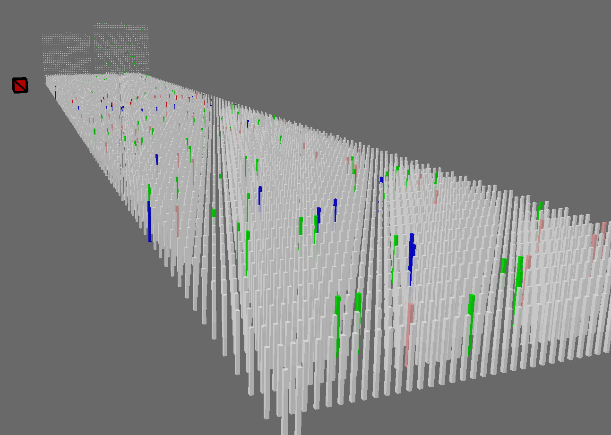
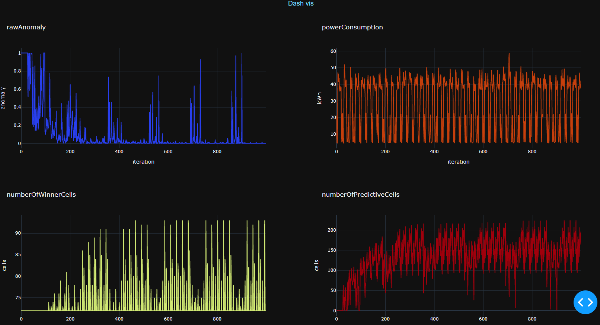

# HTMpandaVis
**See presentation [video](https://youtu.be/c1aJq0p-9uY)!**

Screenshots for visualization of the [2D recognition project](https://discourse.numenta.org/t/2d-object-recognition-project/5465/92)





This project aspires to create tool that helps **visualize HTM systems in 3D** by using opensource framework for 3D rendering https://www.panda3d.org/

It allows to see architecture of the system in 3D space, e.g. connection of several layers and inputs and to see input representation,
activity of columns and even individual cells in each simulation step.
User can observe vast scalable space by moving as "ghost" and interact with objects.
It is supposed as tool for educational purpose or as an inspect tool.

I was inspired by following:
- [HTM school Episode 10 visualization - Topology](https://www.youtube.com/watch?v=HTW2Q_UrkAw&t=688s)
- [Highbrow](https://github.com/htm-community/highbrow)
- [Sanity](https://github.com/htm-community/sanity-nupic) 

The visualization is application written purely in Python3.

# How it works
* Data for visualization are generated by so called "baking". This process generates sqlite3 database file, optionally folder with binary dump files.
* User can open these data in HTMpandaVis and explore them

You can also browse SQLite3 dabase file (.db) directly with ordinary browser such as [Sqlite Browser](https://sqlitebrowser.org/).

## Baking

To bake your simulation, you must use [htm.core](https://github.com/htm-community/htm.core) and extend your script with small amount of code to do the baking.

## Dash plots visualization

HTMpandaVis can be used also to record custom dataStreams with pandaBaker and then visualize it in web browser.
[Dash plotly library](https://plotly.com/dash/) is used. These plots are **interactive!**.
For creating layout arrangement, axis and plot labels, there are JSON layout configuration files. They are located in HTMpandaVis\dashVis\layouts. 
See hotgym example for more informations.

# How to install on Linux

Python >3.6 is recommended.
Also using one of the python environment managers is recommended,
like [Anaconda](https://www.anaconda.com/distribution/)

Install htm.core (here building from source, see [repo readme](https://github.com/htm-community/htm.core) if you need other installation instructions)
```
sudo apt-get install cmake
git clone https://github.com/htm-community/htm.core.git
python setup.py install --user --force
```

Install prerequisities & clone pandaVis
```
sudo apt-get install python3-tk

git clone https://github.com/htm-community/HTMpandaVis.git

python -m pip install -r requirements.txt

 #this installs pandaBaker package for baking process
python setup.py 
```
# Run example
There is hotgym example ported from [htm.core](https://github.com/htm-community/htm.core/tree/master/py/htm/examples) modified for baking.

1. To bake database just navigate into /HotgymExample folder and run hotgym.py:
```
cd HTMpandaVis/HotgymExample
python hotgym.py
```
database will be created inside folder /bakedDatabase

2. Run client - pandaVis tool
```
cd HTMpandaVis
python run.py
```
And choose run 3D explorer or "run both" if you want to run dash visualization also.
